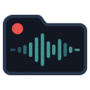
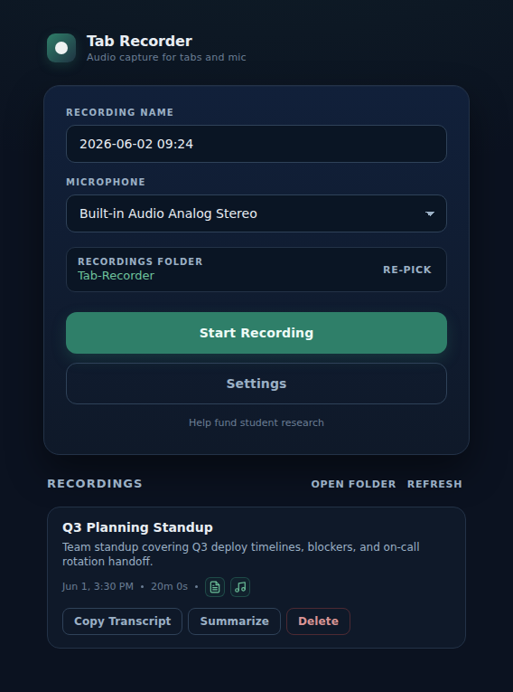

# Tab Recorder



Audio-only tab + microphone recorder for Chromium browsers. Records to your
local Downloads folder, converts to MP3 with [LAME](https://lame.sourceforge.net/)
via [lamejs](https://github.com/zhuker/lamejs), transcribes locally with
[Transformers.js](https://github.com/huggingface/transformers.js) running
Whisper through ONNX Runtime Web (WebGPU when available, WASM CPU fallback),
and **optionally summarizes each recording with Chrome's built-in Gemini Nano**
— strictly opt-in, gated on the model already being present locally so the
extension never triggers the on-device-model download for you.

Nothing leaves your machine except the one-time Whisper model download from
HuggingFace on first transcription. No analytics, no cloud upload, no API keys.

## Quick start

Tested on Chrome and Brave. Both are Chromium and use the same MV3 build.

1. Grab the latest release zip:
   <https://github.com/tensorlabresearch/Tab-Recorder/releases/latest>
   (look for `tab-recorder-vX.Y.Z.zip`).
2. Unzip it to a folder you'll keep around — the browser loads the unpacked
   directory directly.
3. Open the extensions page:
   - Chrome: `chrome://extensions`
   - Brave:  `brave://extensions`
4. Enable **Developer mode** (top-right toggle).
5. Click **Load unpacked** and pick the unzipped folder.
6. Click the Tab Recorder toolbar icon. The recorder opens in its own tab.

First transcription downloads the selected Whisper model (~250 MB for the
default `whisper-small.en`) to your browser's cache. After that it runs offline.

## What it does

- Records audio from any tab plus an optional microphone, with live level
  meters and an elapsed timer.
- Hot-swap the source tab or microphone mid-recording without losing the
  in-progress file. Pause and resume without finalising.
- Saves recordings to `~/Downloads/Tab Recorder/<date>/<name>.webm`.
- Lists every recording in the panel — files Chrome's download history
  forgot still appear via a recursive scan of the granted folder.
- Per-row actions: Convert to MP3, Transcribe, Copy Transcript, Delete.
- MP3 and `.txt` transcript land **next to** the source webm (same folder,
  same basename).
- Live transcript preview during transcription; progress bar walks through
  the recording based on whisper's emitted timestamps.
- Optional auto-transcribe on stop (Settings).
- Optional **on-device summary + one-line description** of each
  recording, produced by Chrome's built-in Gemini Nano when the model
  is already available locally (see "Browser AI" below).

## Browser AI (optional)



If your Chrome already has the built-in **Gemini Nano** model available
locally (the same on-device LLM that powers Chrome's experimental AI
features), Tab Recorder can use it to produce a one-sentence
**description** and a short markdown **summary** for each recording
from its transcript. The output lands next to the recording as
`<name>.summary.md` (YAML frontmatter + a `## Summary` body), and the
description appears as a subtitle under the recording's title in the
panel.

This feature is strictly opt-in and **strictly gated**: the extension
queries `LanguageModel.availability()` and only proceeds when the
status is exactly `"available"`. A status of `"downloadable"` is
treated the same as unsupported, so Tab Recorder will **never**
initiate the ~4 GB on-device-model download for you. Inference runs
locally; nothing leaves your machine.

To enable Nano in Chrome:

1. Open `chrome://flags/#prompt-api-for-gemini-nano` → **Enabled**.
2. Open `chrome://flags/#optimization-guide-on-device-model` →
   **Enabled BypassPerfRequirement**.
3. Restart Chrome.
4. Open `chrome://components`, find **"Optimization Guide On Device
   Model"**, and click **Check for update** until a version appears
   (this triggers the model download — outside of Tab Recorder).
5. Verify in DevTools: `await LanguageModel.availability()` should
   return `"available"`.

Once available, Settings → **Browser AI** shows the live status, and
each recording with a transcript gets a **Summarize** button next to
**Copy Transcript**. Toggle **Auto-summarize after transcription** if
you want the sidecar generated automatically every time a transcript
finishes.

## Settings

Open Settings from the panel:

- **Recordings folder**: status only. Files go to `~/Downloads/Tab Recorder/`
  via the browser's Downloads behaviour.
- **Whisper model**: choose between tiny.en (~40 MB), base.en (~80 MB),
  small.en (~250 MB, default), or base multilingual.
- **Engine**: shows whether WebGPU is usable on this machine. WASM CPU is
  the automatic fallback.
- **Download / Warm Up Model**: pre-fetches the selected model so the first
  Transcribe click doesn't have to wait on the download.
- **Clear Model Cache**: deletes the cached model files.
- **Auto-transcribe new recordings**: when on, transcription starts the
  moment a recording stops.
- **Browser AI**: status row that reports whether Chrome's built-in
  Gemini Nano model is available on this device, plus the
  **Auto-summarize after transcription** toggle (disabled until Nano
  is detected). See the [Browser AI](#browser-ai-optional) section
  above for setup details.

## Development

```sh
git clone git@github.com:tensorlabresearch/Tab-Recorder.git
cd Tab-Recorder
npm ci
npm test
```

To load the in-tree extension (no build step needed):

- `chrome://extensions` -> Developer mode -> Load unpacked
- Select `extension/`

After updates, click **Reload** on the extension card.

> **Heads up:** if during development you point Tab Recorder's "Recordings
> folder" at your local clone of this repo (e.g. picking the repo root as
> the granted directory), the extension will write `.webm` / `.txt` /
> `.summary.md` files into dated subfolders inside the repo. Add a line
> like `^/\d{4}-\d{2}-\d{2}/` to your **local** `.git/info/exclude` (or
> `.gitignore` if you want to share the exclusion) to keep those out of
> your status output.

### Vendored dependencies

The Transformers.js bundle and ONNX Runtime Web WASM artifacts are vendored at
`extension/lib/transformersJs/` because MV3 forbids
remote-hosted scripts/wasm. Re-vendor them after a dependency bump:

```sh
npm run vendor:transformers
```

### Tests

```sh
npm test               # vitest, all unit tests
```

GitHub Actions runs the same suite on every push and pull request to `main`
(`.github/workflows/ci.yml`).

## Releases

Releases are produced automatically from `main`. Every push to `main` triggers
`.github/workflows/auto-release.yml` which:

1. Runs the test suite.
2. Reads commit messages since the last tag.
3. Picks a SemVer bump (`feat:` -> minor, breaking change -> major, anything
   else -> patch).
4. Updates `package.json` and `extension/manifest.json`.
5. Commits, tags `vX.Y.Z`, builds `tab-recorder-vX.Y.Z.zip`, and publishes a
   GitHub Release with auto-generated notes.

Use [Conventional Commits](https://www.conventionalcommits.org/) (`feat:`,
`fix:`, `chore:`, etc.) for the bump heuristic to behave correctly. Mark
breaking changes with `feat!:` or a `BREAKING CHANGE:` footer to force a major
bump.

## Repo layout

```
Tab-Recorder/
├── .github/workflows/   - CI, auto-release
├── extension/  - extension source (manifest, panel, settings, lib)
├── scripts/             - vendor + maintenance scripts
├── tests/               - vitest unit tests + helpers
└── tools/               - standalone power-user utilities (optional)
```

## Support our work

Tab Recorder is built and maintained by a small AI research team
alongside our student research programs. The extension itself is, and
will stay, completely free — donations are voluntary, non-refundable,
and don't unlock anything.

If you'd like to chip in, the in-extension **Help fund student research**
link (bottom of the panel) opens a support page with a copy/open-wallet
button. For convenience, the Bitcoin address is also here:

```
3C8MP16nhPVEAPecFZ7tudSjDXkg2zVYEB
```

Please use the **Bitcoin network only**. Cryptocurrency transactions are
irreversible — double-check the address before sending.

Other ways to help: share Tab Recorder with anyone who needs local
audio recording, leave a review on the Chrome Web Store, or report
bugs / feature ideas as GitHub issues.

## License

Project code under the MIT license. Vendored runtimes carry their own
licenses (LAME / lamejs LGPL-3.0; Transformers.js Apache-2.0;
ONNX Runtime Web MIT) preserved next to the bundles in
`extension/lib/`.
